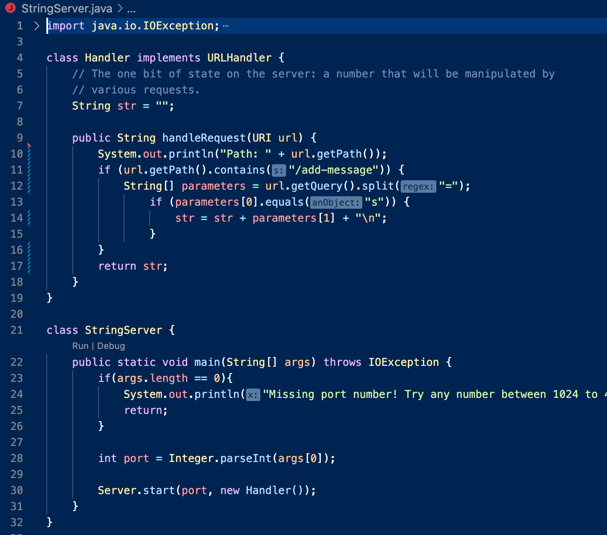
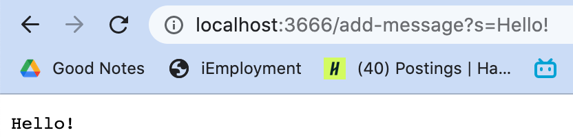
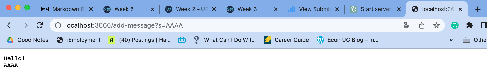

# Second Lab Report - Jun T.
## 1. WebServer - StringServer
Code of StringServer.java:



First Screenshot:
1. Methods `public String handleRequest` and `public static void main` are called.
2. For the method `public String handleRequest` the argument is `URI url`, the values are `String str` and `String[] parameters`. For the method `public static void main` the argument is `String[] args`, the value is `int port`.
3. For `class Handler`, `String str` changes to `Hello! + "\n"`. For `class StringServer`, `int port` changes to `3666`. 



Second Screenshot:
1. Methods `public String handleRequest` and `public static void main` are called.
2. For the method `public String handleRequest` the argument is `URI url`, the values are `String str` and `String[] parameters`. For the method `public static void main` the argument is `String[] args`, the value is `int port`.
3. For `class Handler`, `String str` changes to `Hello! + "\n" + 123 + "\n" + AAAA + "\n"`. For `class StringServer`, `int port` changes to `3666`. 



## 2. One bug from lab3
1. Failure-inducing input:
```
@Test
public void testReversed() {
  int[] input2 = {2,3,4,5};
  ArrayExamples.reverseInPlace(input2);
  assertArrayEquals(new int[]{5,4,3,2}, input2);
}
```

2. Input that doesn't induce a failure:
```
@Test
public void testReversed() {
  int[] input1 = { };
  assertArrayEquals(new int[]{ }, ArrayExamples.reversed(input1));
}
```

3. Outputs:
  * Failure-inducing:

