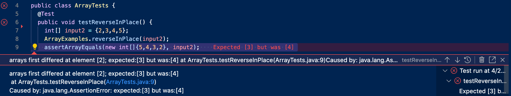
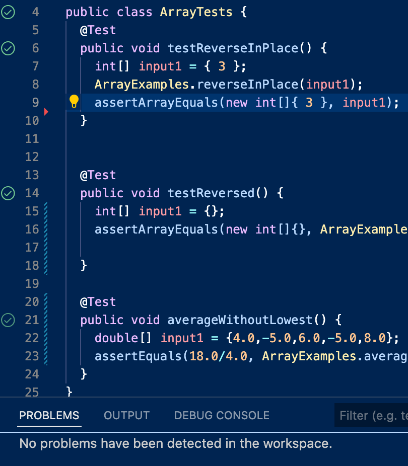

# Second Lab Report - Jun T.
## 1. WebServer - StringServer
Code of StringServer.java:
```
import java.io.IOException;

class Handler implements URLHandler {
    // The one bit of state on the server: a number that will be manipulated by
    // various requests.
    String str = "";

    public String handleRequest(URI url) {
        System.out.println("Path: " + url.getPath());
        if (url.getPath().contains("/add-message")) {
            String[] parameters = url.getQuery().split("=");
                if (parameters[0].equals("s")) {
                    str = str + parameters[1] + "\n";
                }
        }
        return str;
    }
}

class StringServer {
    public static void main(String[] args) throws IOException {
        if(args.length == 0){
            System.out.println("Missing port number! Try any number between 1024 to 49151");
            return;
        }

        int port = Integer.parseInt(args[0]);

        Server.start(port, new Handler());
    }
}
```

First Screenshot:
1. Methods `public String handleRequest` and `public static void main` are called.
2. For the method `public String handleRequest` the argument is `URI url`, the values are `String str` and `String[] parameters`. For the method `public static void main` the argument is `String[] args`, the value is `int port`.
3. For `class Handler`, `String str` changes to `Hello! + "\n"`. For `class StringServer`, `int port` changes to `3666`. 


Second Screenshot:
1. Methods `public String handleRequest` and `public static void main` are called.
2. For the method `public String handleRequest` the argument is `URI url`, the values are `String str` and `String[] parameters`. For the method `public static void main` the argument is `String[] args`, the value is `int port`.
3. For `class Handler`, `String str` changes to `Hello! + "\n" + 123 + "\n" + AAAA + "\n"`. For `class StringServer`, `int port` changes to `3666`. 


## 2. One bug from lab3
1. Failure-inducing input:
```
@Test 
public void testReverseInPlace() {
  int[] input2 = {2,3,4,5};
  ArrayExamples.reverseInPlace(input2);
  assertArrayEquals(new int[]{5,4,3,2}, input2);
}
```

2. Input that doesn't induce a failure:
```
@Test 
public void testReverseInPlace() {
  int[] input1 = { 3 };
  ArrayExamples.reverseInPlace(input1);
  assertArrayEquals(new int[]{ 3 }, input1);
}
```

3. Outputs:
  * Failure-inducing:
  
  
  
  * Non-failure-inducing:
  
  
  
4. Bug:
  * Before:
```
static void reverseInPlace(int[] arr) {
  for(int i = 0; i < arr.length; i += 1) {
    arr[i] = arr[arr.length - i - 1];
  }
}
```
  * After:
```
static void reverseInPlace(int[] arr) {
  for(int i = 0; i < arr.length/2; i += 1) {
    int temp = arr[i];
    arr[i] = arr[arr.length - i - 1];
    arr[arr.length - i - 1] = temp;
  }
}
```
The `static void reverseInPlace(int[] arr)` method needs a temp to get the first index and save it, then update the first index with the last element, then update the last index with the temp (first index). The length in the for loop also needed to be divided by 2 so that it does not redo the entire thing because without the division it would flip all the elements, and then flip them back. 

## 3. Something I learned new
* From lab2, I knew how to build and run a server both on my computer as well as remotely. I learned that each person can only visit one localhost at one time. For example, if someone else in the lab is accessing `localhost:4000/` then I cannot access the same webpage. I need to choose another website like `localhost:3888` to access.
* From lab3, I learned how to debug in a shortcut from my lab partner. Try out some unique cases like empty list/array and zero integer can help debugging more quickly than staring at the code and trying to find the bug from staring.
